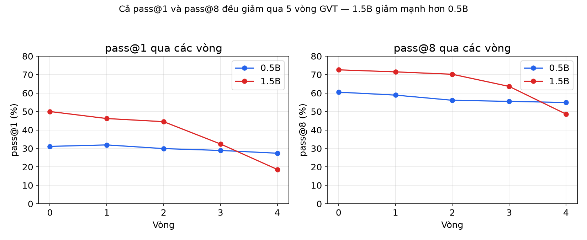
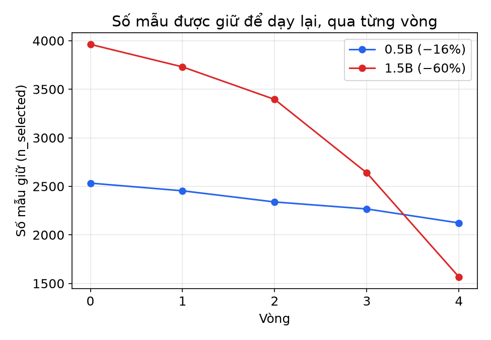

# Khung bài báo — bản nháp (2026-09-03)

Viết bằng tiếng Việt để dễ chỉnh, dịch sang tiếng Anh sau khi nội dung chốt
(nếu yêu cầu nộp là tiếng Anh — kiểm tra `CAU-HOI-THAY.md`). Mỗi mục ghi rõ
**[XONG]** (đã có số/nội dung thật) hay **[CẦN LÀM]** (còn thiếu) để biết
việc gì còn lại.

---

## Tiêu đề

**"When the Grader Has a Style: Format-Biased Verifiers Cause Capability
Collapse in Iterative Self-Training of Small Reasoning Models"**

(tiếng Việt: "Khi máy chấm có gu: verifier lệch-vì-văn-phong gây sụp năng
lực trong tự-huấn-luyện lặp vòng ở model suy luận nhỏ")

**[XONG]** — chốt sau khi nội dung ổn định (2026-09-03). Đổi từ "Degrades"
sang "Cause Capability Collapse" để nhấn đúng phát hiện chính (sụp năng
lực thật, không chỉ học lệch văn phong) — khớp với Abstract/Conclusion.

---

## Abstract (nháp ngắn)

Iterative self-training loops (generate → verify → select → train, "GVT")
are used to improve small language models on math reasoning without human
labels, on the assumption that an automated verifier reliably separates
correct from incorrect solutions. We show that when the verifier is
rule-based and exhibits a *directional* bias — rejecting correct solutions
written in unexpected but valid formats (false negatives), while almost
never accepting incorrect ones (near-zero false positives) — this bias
compounds across self-training rounds and can cause **outright capability
degradation**, not merely stylistic convergence. Running the GVT loop for
5 rounds on GSM8K and MATH-500 with `math-verify` as the verifier, we find
that both pass@1 and pass@8 *decline* monotonically for two model sizes
(Qwen2.5-0.5B and 1.5B), with the larger model degrading substantially more
(pass@1: 50.0%→18.6% vs 31.1%→27.4%). Writing style converges alongside the
decline (e.g. `\boxed{}` usage drops by over half at 1.5B). We connect this
to a shrinking-training-pool mechanism: the verifier-accepted example pool
shrinks every round (by ~60% at round 5 for the 1.5B model), so each
round's fresh LoRA adapter is trained on an increasingly narrow, biased
sample. Unlike prior work that studies verifier bias in a single round
(TinyV, From Accuracy to Robustness, Imperfect Verifiers) or runs
multi-round self-training without characterizing — or, in one case,
with an explicitly exact, unbiased — verifier (ReST-EM; Teacher-Free
Self-Training, whose verifier is defined by exact string equality), we
are — to our knowledge — the first to combine a *measured, directionally
biased* verifier with multi-round self-training and track both capability
and stylistic drift together.

**[XONG]** khung nội dung, số liệu thật đã có, câu so sánh với Related
Work đã khớp sau khi đọc bản đầy đủ 4 bài (2026-09-03). **[CẦN LÀM]** rút
gọn còn ~150-200 từ đúng chuẩn abstract khi nộp — hiện đang dài hơn mức
chuẩn vì viết đủ ý trước, cắt gọn câu chữ sau.

---

## 1. Introduction

**[XONG]**

Các hệ thống suy luận toán học gần đây thường được cải thiện bằng cách cho
chính model tự sinh lời giải, giữ lại những lời giải "đúng" theo một máy
chấm tự động (verifier), rồi huấn luyện lại chính model đó trên tập vừa
giữ — lặp lại nhiều vòng. Cách làm này, mà chúng tôi gọi là vòng lặp
**Generate-Verify-Train (GVT)**, là nền tảng của cả một họ phương pháp
(STaR, ReST/ReST-EM, RFT) được ưa chuộng vì không cần người gán nhãn thêm:
verifier tự động đóng vai trò "giáo viên", chỉ cần biết đúng/sai, không cần
lời giải mẫu.

Toàn bộ họ phương pháp này dựa trên một giả định ngầm: verifier phân biệt
đúng/sai một cách đáng tin cậy. Giả định đó gần như luôn sai trong thực tế
khi verifier là verifier **luật** (rule-based) — loại verifier phổ biến
nhất cho toán, vì rẻ, nhanh, không cần train riêng. Verifier luật (như
`math-verify`, dùng trong bài này) chỉ trích xuất đáp án cuối cùng trong
bài làm rồi so với đáp án sách sau khi chuẩn hoá — nó **không đọc lời
giải**, và bước chuẩn hoá không bao giờ phủ hết mọi cách viết tương đương.
Hệ quả là verifier luật gạch nhầm (false negative) những lời giải **đúng**
nhưng viết theo cách nó không nhận ra. Đo trực tiếp trên `math-verify`
(mục 3, thí nghiệm sơ bộ của chúng tôi): tỷ lệ gạch nhầm gần 0% trên
GSM8K (đáp án số nguyên đơn giản) nhưng lên tới ~7.8% trên MATH (đáp án có
phân số, LaTeX phức tạp), và một số cách viết hợp lệ (ví dụ dùng `\dfrac`
thay vì `\frac`) bị gạch **100%** dù đáp án đúng giá trị. Quan trọng hơn:
độ lệch này **có hướng** — verifier gần như không bao giờ khen nhầm (false
positive ≈ 0%), chỉ gạch nhầm theo đúng 1 chiều.

Câu hỏi trung tâm của bài này: khi một verifier lệch-có-hướng như vậy được
dùng làm bộ lọc trong vòng lặp GVT, **lặp lại nhiều vòng** (không phải 1
lần) sẽ gây hậu quả gì? Các nghiên cứu trước đây đã đo một trong hai vế —
hoặc verifier lệch nhưng chỉ xét 1 vòng huấn luyện (TinyV, Imperfect
Verifiers, From Accuracy to Robustness), hoặc lặp nhiều vòng nhưng verifier
gần như hoàn hảo (ReST-EM, Teacher-Free Self-Training) — chưa nghiên cứu
nào ghép cả hai điều kiện cùng lúc và đo cả năng lực thật (pass@1, pass@k)
lẫn sự hội tụ văn phong đầu ra qua các vòng (mục 2).

**Đóng góp của bài này:**

- Đo thực nghiệm hiện tượng verifier lệch-vì-format tích luỹ qua 5 vòng
  GVT, trên 2 cỡ model (Qwen2.5-0.5B và 1.5B-Instruct), 2 bộ đề (GSM8K,
  MATH-500), với `math-verify` — verifier luật thật, không giả lập.
- Phát hiện chính: hậu quả không chỉ là "học lệch văn phong" như giả thuyết
  ban đầu dự đoán (model chỉ đứng yên hoặc giả vờ giỏi) — mà là **sụp năng
  lực thật**: cả pass@1 lẫn pass@8 cùng giảm đơn điệu qua các vòng ở cả hai
  cỡ model, đi kèm hội tụ văn phong đầu ra.
- Phát hiện phụ, phản trực giác: mức độ sụp **tăng theo cỡ model** — model
  1.5B (gấp 3 lần tham số) sụp mạnh hơn hẳn model 0.5B (pass@1 giảm 63% so
  với 12%), không ổn định hơn như có thể kỳ vọng ở model lớn hơn.

---

## 2. Related Work — khác biệt đã xác nhận qua khảo sát 29 bài + đọc bản đầy đủ

**[XONG]** — đã đọc bản đầy đủ (không chỉ abstract) của ReST-EM và
Teacher-Free Self-Training qua `arxiv.org/html/...` để xác nhận chi tiết
dưới đây, không đoán từ abstract.

**ReST-EM (Singh et al., 2312.06585)** dùng đúng khung 3 bước GVT (sinh →
lọc bằng phản hồi nhị phân → SFT lại → lặp), sinh 32 mẫu/đề cho MATH (64
cho APPS) ở bước E. Verifier cho MATH so đáp án cuối với đáp án chuẩn,
nhưng bài không đặc tả cơ chế so sánh có khoan dung định dạng hay không —
tức là hoàn toàn có thể verifier của họ cũng mắc lỗi false-negative giống
`math-verify`, chỉ là họ không đo/không nhắc tới. Kết quả của họ trên MATH:
"cải thiện test nhỏ dần sau vòng đầu tiên"; trên APPS họ tự ghi nhận **một
vòng bị regression (tụt điểm) ở vòng 2** — gần với hiện tượng "sụp" mà bài
này đo được, nhưng ReST-EM không phân tích nguyên nhân, không liên hệ tới
verifier hay văn phong, và không thấy lặp lại quan sát này trên MATH (bộ đề
chính họ báo cáo). Họ cũng tự nhận một giới hạn liên quan: pass@1 cải
thiện rõ nhưng "chưa hẳn thu hẹp khoảng cách với pass@K" — cùng tinh thần
"sharpening không phải mở rộng năng lực" nhưng đo và diễn giải khác bài
này.

**Teacher-Free Self-Training (Strozzi, 2606.07856)** cũng chạy **3 vòng
self-training tuần tự** (v0→v1→v2, đúng nghĩa GVT lặp vòng, không phải 1
lần train duy nhất) trên miền FlashFill-kiểu "trapdoor" (sinh rẻ, khó đảo
ngược, kiểm chứng miễn phí). Điểm khác biệt quyết định: verifier của họ
**so khớp chuỗi tuyệt đối** ("correctness is decided by exact string
equality, so the verifier has zero learned opinion") — nghĩa là **không hề
lệch**, đối lập trực tiếp với `math-verify`. Chỉ số pass@8/pass@64 của họ
đo **model cuối cùng sau khi train xong**, ở hai ngân sách lấy mẫu khác
nhau (không phải bảng pass@1/pass@k theo từng vòng như bài này) — họ thấy
model train xong thắng ở ngân sách nhỏ (pass@8) nhưng thua model gốc ở
ngân sách lớn (pass@64), kết luận "khuếch đại nhưng không cộng dồn". Vì
verifier của họ không lệch, phát hiện này giải thích được bằng riêng cơ chế
sharpening (tập trung xác suất vào lời giải đã biết) — không cần và không
có yếu tố verifier-lệch như bài này.

**From Accuracy to Robustness (Huang et al., 2505.22203)** — đọc bản đầy đủ
— đo trực tiếp recall của verifier luật trong RLVR toán: **trung bình chỉ
86% recall (tức ~14% false negative)**, có bộ verifier tụt còn 78% recall
(Skywork-OR1). Đây là số liệu độc lập, cùng chiều với FN ~7.8% đo được ở
`math-verify`/MATH trong bài này (mục 3) — củng cố rằng lệch verifier không
phải hiện tượng hiếm hay đặc thù của riêng `math-verify`. Tuy huấn luyện
RL của họ chạy 500-600 bước, **bài không theo dõi hệ thống recall của
verifier thay đổi ra sao theo thời gian huấn luyện** — họ ghi nhận một vấn
đề khác (reward hacking khi dùng verifier học được/model-based), không
phải hiện tượng sụp năng lực do verifier luật lệch mà bài này đo.

**Imperfect Verifiers (Cai et al., 2510.00915)** — đọc bản đầy đủ — có
framework nhiễu hình thức nhất: verifier trả về đúng/sai với xác suất
ρ₀ (khen nhầm) và ρ₁ (gạch nhầm) cố định, thử nghiệm với ρ₀=0.1, ρ₁=0.2.
Điểm mấu chốt, trích trực tiếp từ Section 3.1 của họ: *"real-world noise
can depend on content, formatting, prompt style"* — họ **tự nêu ra** đúng
loại lệch mà bài này đo, nhưng chủ động **giả định tỷ lệ nhiễu cố định,
không phụ thuộc nội dung** để đơn giản hoá bài toán, và chỉ chạy **1 vòng
RL** (GRPO) — không nghiên cứu nhiễu tích luỹ qua nhiều vòng. Bài này lấp
đúng khoảng trống họ tự nêu ra nhưng không giải quyết.

**TinyV (Xu et al., 2505.14625)** đo FN trực tiếp (~38% trên tập họ xét) và
xác nhận verifier luật hay gạch nhầm — nhưng hướng giải quyết của họ là
**sửa** verifier (thêm một verifier phụ bằng LLM để cứu lại các ca gạch
nhầm), chỉ trong 1 lần đánh giá. Bài này đi hướng ngược lại: **không sửa
verifier**, chỉ đo hậu quả khi giữ nguyên verifier lệch và lặp nhiều vòng.

**Chốt, sau khi đọc bản đầy đủ cả 4 bài gần nhất (không chỉ dựa abstract):**
chưa bài nào ghép đủ 3 mảnh — verifier lệch-vì-format thật (không phải
nhiễu giả lập cố định) + lặp nhiều vòng self-training + đo cả năng lực
(pass@1/pass@k) lẫn hội tụ văn phong đầu ra cùng lúc. Đáng chú ý: 2 bài
độc lập (ReST-EM, Imperfect Verifiers) đều **chạm gần** khoảng trống này —
ReST-EM tự ghi nhận regression ở vòng 2 trên APPS mà không điều tra
nguyên nhân, Imperfect Verifiers tự nêu ra khả năng "nhiễu phụ thuộc định
dạng" mà không nghiên cứu — gợi ý đây là khoảng trống mà chính các tác giả
khác cũng đã thoáng nhận ra nhưng chưa ai theo tới cùng. Đã xác nhận qua
khảo sát 29 bài (`papers/KHAO-SAT.md`, tra lại 2 lần: WebSearch/WebFetch
2026-08-23, Semantic Scholar 2026-08-24) và đọc trực tiếp bản đầy đủ 4 bài
gần nhất (2026-09-03).

---

## 3. Method

**[XONG]**

- **Vòng lặp GVT:** generate (k mẫu/đề) → verify (`math-verify==0.9.0`,
  antlr4 4.13.2) → select (giữ mẫu verifier chấm đúng) → train (LoRA mới
  từ base, không cộng dồn qua vòng) → lặp.
- **Model:** Qwen2.5-0.5B-Instruct, Qwen2.5-1.5B-Instruct.
- **Dữ liệu:** GSM8K + MATH-500, 500 đề/bộ, k=8 mẫu/đề/vòng, 5 vòng. Cả
  bước `select` (chọn mẫu để dạy) lẫn `exam` (đo pass@1/pass@k) đều chạy
  trên **tập test** của GSM8K/MATH-500 — chưa tách riêng train/test (giới
  hạn, xem mục 6.2). Mỗi cấu hình model×dataset chỉ chạy **1 lần** (chưa
  lặp seed để đo phương sai — giới hạn, xem mục 6.1).
- **Train:** LoRA (r=16, alpha=32), SFT qua `transformers`+`peft`+TRL
  `SFTTrainer`, 1 epoch/vòng, không phải GRPO/RL trực tiếp — quyết định có
  ghi lại lý do trong `HUONG-DAN.md` (GRPO không khớp thiết kế select→train
  sẵn có).
- **Đo:** pass@1, pass@8 (per exam preset `default`/`reward`), đếm văn
  phong (11 nhãn: `boxed`, `dfrac`, `tfrac`, `frac`, `dollar`, `sentence`,
  `assignment`, `unit`, `decimal`, `decimal_trailing`, `int_float`), bảng
  A/B/C (đề mới giải được / ổn định / mất đề) so vòng liền trước.
- **Hạ tầng:** Kaggle T4, chạy qua `experiments/viec3/run.py --mode hf`
  (code: `src/dacntt/gvt/`).

---

## 4. Results

**[XONG]** — số thật, lấy nguyên từ `results/viec3/qwen05b-n500/table.md`
và `results/viec3/qwen15b-n500/table.md`.

### 4.1 pass@1 và pass@8 qua các vòng

| Model | Vòng 0 | Vòng 1 | Vòng 2 | Vòng 3 | Vòng 4 | Δ (vòng 0→4) |
|---|---|---|---|---|---|---|
| 0.5B pass@1 | 31.1% | 31.9% | 29.9% | 28.9% | 27.4% | −3.7 điểm (−12%) |
| 0.5B pass@8 | 60.5% | 58.9% | 56.1% | 55.5% | 54.9% | −5.6 điểm (−9%) |
| 1.5B pass@1 | 50.0% | 46.2% | 44.5% | 32.4% | 18.6% | **−31.4 điểm (−63%)** |
| 1.5B pass@8 | 72.6% | 71.5% | 70.2% | 63.6% | 48.6% | **−24.0 điểm (−33%)** |

Cả 4 chuỗi đều giảm đơn điệu hoặc gần đơn điệu (0.5B pass@1 có 1 điểm tăng
nhẹ ở vòng 1, còn lại giảm đều) — không phải dao động nhiễu ngẫu nhiên.

### 4.2 Kích thước tập huấn luyện co hẹp dần

| Model | Vòng 0 | Vòng 4 | Giảm |
|---|---|---|---|
| 0.5B (n giữ để ôn) | 2533 | 2123 | −16% |
| 1.5B (n giữ để ôn) | 3962 | 1566 | **−60%** |

### 4.3 Văn phong hội tụ

1.5B, `\boxed{}`: 5608 → 2693 lần (trên 8000 lần viết/vòng) — giảm hơn nửa.
`$...$` (dollar): 1453 → 3406 — tăng hơn gấp đôi. Chi tiết đầy đủ 11 nhãn ở
2 file `table.md` gốc.

### 4.4 Bảng A/B/C (đề thêm/ổn định/mất, 1.5B)

| Vòng | A (thêm) | B (ổn định) | C (mất) |
|---|---|---|---|
| 1 | 47 | 75 | 58 |
| 2 | 53 | 88 | 66 |
| 3 | 51 | 60 | **117** |
| 4 | 44 | 43 | **194** |

C vượt A ở cả 4/4 vòng, khoảng cách nới rộng mạnh ở 2 vòng cuối — đúng dạng
sụp tăng tốc.

---

## 5. Discussion — vì sao sụp, vì sao 1.5B sụp nặng hơn

**[XONG]**

**Cơ chế đề xuất — vòng lặp tự-siết qua tập huấn luyện co hẹp.** Trong
thiết kế GVT của bài này, mỗi vòng huấn luyện một adapter LoRA **mới**
từ base model, chỉ trên đúng tập mẫu mà verifier chấp nhận ở vòng ngay
trước đó — không cộng dồn qua các vòng. Vì verifier lệch có hướng (chỉ
gạch nhầm, gần như không khen nhầm), tập mẫu "được chấp nhận" ở mỗi vòng
vừa **co hẹp dần** (mục 4.2: 1.5B mất 60% số mẫu qua 5 vòng) vừa **nghiêng
về đúng 1 kiểu viết** mà verifier ưa (mục 4.3). Vòng sau vì vậy học từ một
tập mẫu vừa nhỏ hơn vừa kém đa dạng hơn vòng trước — và vì tập đó đến từ
chính output của model vòng trước (đã bị lọc qua verifier lệch), sai lệch
không tự triệt tiêu mà **cộng dồn qua từng vòng**. Đây là một dạng vòng lặp
tự-siết (self-reinforcing feedback loop), có họ hàng gần với hiện tượng
"model collapse" khi train liên tục trên dữ liệu tự sinh (Shumailov et
al., xem `papers/KHAO-SAT.md` nhóm 4) — nhưng khác ở một điểm quan trọng:
model collapse cổ điển xảy ra khi train trên **toàn bộ** phân phối đầu ra
tự sinh (không lọc), trong khi hiện tượng ở đây xảy ra ngay cả khi chỉ
train trên đúng tập đã **lọc qua verifier tưởng-là-đáng-tin**. Nói cách
khác: lọc bằng verifier không ngăn được collapse nếu bản thân bộ lọc đó
lệch có hướng — nó chỉ đổi hình dạng của collapse (co hẹp và lệch về 1
kiểu viết) thay vì ngăn nó.

**Vì sao 1.5B sụp nặng hơn 0.5B.** Đây là quan sát phản trực giác nhất của
bài — thường kỳ vọng model lớn hơn ổn định hơn, không phải ngược lại.
Giả thuyết hợp lý nhất (nhưng **chưa được chứng minh trực tiếp** trong
nghiên cứu này): với cùng cấu hình huấn luyện (LoRA rank 16, 1 epoch/vòng),
model có nhiều tham số hơn có khả năng khớp (fit) nhanh và chặt hơn vào
đúng tập mẫu đã cho — kể cả khi tập đó nhỏ và lệch. Việc khớp nhanh hơn vào
một tập ngày càng hẹp có thể đẩy nhanh tốc độ mất đa dạng/năng lực tổng
quát so với model nhỏ hơn, vốn khớp chậm hơn nên "giữ lại" được nhiều hành
vi tổng quát hơn qua mỗi vòng. Một khả năng khác không loại trừ được: hai
model có learning rate/hyperparameter hiệu dụng khác nhau về mặt thực tế dù
cùng con số cấu hình (cùng learning rate danh nghĩa nhưng ảnh hưởng khác
nhau lên model có kích thước khác nhau). Để khẳng định chắc cơ chế nào
đúng, cần thêm thí nghiệm trực tiếp đo tốc độ overfit (train loss trên tập
giữ lại mỗi vòng, hoặc độ đa dạng của output trước khi lọc qua verifier) —
nằm ngoài phạm vi số liệu hiện có của bài này.

---

## 6. Limitations

**[XONG]** liệt kê trung thực:

6.1. Mỗi cấu hình (model × dataset) chỉ chạy **1 lần** — chưa đo phương sai
   qua nhiều seed. Xu hướng giảm khá đều nên khó là nhiễu thuần, nhưng
   không loại trừ hoàn toàn.
6.2. `select`/`exam` đều dùng **tập test** GSM8K/MATH-500, chưa tách train/
   test riêng — nếu cần chuẩn academic chặt, phải tách trước khi coi là số
   liệu cuối cùng.
6.3. Chỉ 2 cỡ model (0.5B, 1.5B), chưa rõ xu hướng "to hơn sụp nặng hơn" có
   tiếp tục ở cỡ lớn hơn (7B+) hay đảo chiều ở đâu đó.
6.4. Chỉ 5 vòng — chưa biết đường cong có tiếp tục giảm, chững lại, hay hồi
   phục nếu chạy thêm vòng.

---

## 7. Conclusion

**[XONG]**

Chúng tôi đo trực tiếp hậu quả của việc dùng một verifier luật lệch-có-
hướng (rejecting đúng-nhưng-khác-định-dạng, gần như không bao giờ chấp
nhận sai) làm bộ lọc trong vòng lặp tự-huấn-luyện GVT, lặp qua 5 vòng, trên
2 cỡ model suy luận toán nhỏ. Kết quả không khớp với 2 kịch bản dự đoán ban
đầu (giỏi thật lên đều; hoặc chỉ học lệch văn phong trong khi năng lực
đứng yên) — thay vào đó, cả pass@1 lẫn pass@8 cùng **giảm đơn điệu** ở cả
hai model, đi kèm hội tụ văn phong đầu ra và co hẹp mạnh tập huấn luyện qua
mỗi vòng. Mức độ sụp tăng theo cỡ model, trái với trực giác thường gặp.

Thông điệp chính cho người xây các pipeline self-training tương tự (GVT,
STaR, ReST-EM và họ hàng): pass@1 tăng qua các vòng **không đủ** để kết
luận model đang cải thiện — cần theo dõi song song pass@k (khả năng retry)
và độ đa dạng văn phong đầu ra, đặc biệt khi verifier là verifier luật
(hầu như luôn có false-negative thật trong thực tế, như đo được ở mục 3).
Khoảng trống mà 29 bài khảo sát trước đó chưa lấp (verifier lệch-vì-format
+ nhiều vòng + đo cả năng lực lẫn văn phong cùng lúc) hoá ra không chỉ là
khoảng trống lý thuyết — số liệu thật cho thấy hậu quả có thể nghiêm trọng
hơn nhiều so với giả thuyết "chỉ học lệch văn phong" ban đầu.

**Hướng tiếp theo:** (1) lặp lại thí nghiệm với nhiều seed để đo phương
sai; (2) tách train/test riêng thay vì dùng tập test cho cả select lẫn
exam; (3) thử một cỡ model thứ ba (lớn hơn 1.5B) để xem xu hướng "to hơn
sụp nặng hơn" có tiếp tục hay có điểm đảo chiều; (4) thí nghiệm trực tiếp
kiểm chứng giả thuyết overfit-nhanh-hơn ở mục 5 (đo train loss/độ đa dạng
output theo từng vòng).

---

## References

**[XONG]** — 8 bài được trích dẫn thật trong bài (không phải cả 29 bài
khảo sát), tác giả/ngày lấy từ `papers/KHAO-SAT.md` (đã tra qua
WebSearch/WebFetch + Semantic Scholar, xác nhận lại trực tiếp trên arXiv
với 2 bài có tên tác giả từng lệch giữa các nguồn).

1. Cai, X.-Q., Wang, W., Liu, F., Liu, T., Niu, G., & Sugiyama, M. (2025). *Reinforcement Learning with Verifiable yet Noisy Rewards under Imperfect Verifiers.* arXiv:2510.00915.
2. Cobbe, K., Kosaraju, V., Bavarian, M., et al. (2021). *Training Verifiers to Solve Math Word Problems.* arXiv:2110.14168. (nguồn bộ đề GSM8K)
3. Hendrycks, D., Burns, C., Kadavath, S., et al. (2021). *Measuring Mathematical Problem Solving With the MATH Dataset.* arXiv:2103.03874. (nguồn bộ đề MATH/MATH-500)
4. Huang, Y., Zeng, W., Zeng, X., Zhu, Q., & He, J. (2025). *From Accuracy to Robustness: A Study of Rule- and Model-based Verifiers in Mathematical Reasoning.* arXiv:2505.22203.
5. Shumailov, I., Shumaylov, Z., Zhao, Y., Papernot, N., Anderson, R., & Gal, Y. (2024). *AI models collapse when trained on recursively generated data.* Nature. DOI: 10.1038/s41586-024-07566-y.
6. Singh, A., Co-Reyes, J. D., Agarwal, R., et al. (2023). *Beyond Human Data: Scaling Self-Training for Problem-Solving with Language Models.* arXiv:2312.06585. (ReST-EM)
7. Strozzi, I. L. (2026). *Teacher-Free Self-Training Amplifies but Does Not Compound: A Pass@k Crossover on a Free-Verifier Domain.* arXiv:2606.07856.
8. Xu, Z., Li, Y., Jiang, F., Ramasubramanian, B., Niu, L., Lin, B., & Poovendran, R. (2025). *TinyV: Reducing False Negatives in Verification Improves RL for LLM Reasoning.* arXiv:2505.14625.

Format hiện tại là APA-rút-gọn (tên/năm/tiêu đề in nghiêng/arXiv ID). **Nếu
trường yêu cầu format khác (IEEE, ACM...) — đổi lại sau khi biết qua
`CAU-HOI-THAY.md`, nội dung/thứ tự tác giả đã đúng, chỉ cần đổi cách trình
bày.**

---

## Việc còn lại để hoàn thiện bản thảo

Đã xong hết phần làm được mà không cần thầy trả lời (2026-09-03):

1. ~~Đọc bản đầy đủ Teacher-Free Self-Training~~ — **Xong**: xác nhận 3 vòng thật, verifier không lệch, pass@8/pass@64 đo model cuối chứ không theo từng vòng — đã sửa câu so sánh ở mục 2.
2. ~~Đọc bản đầy đủ ReST-EM~~ — **Xong**: k=32 mẫu/đề (MATH), họ tự ghi nhận regression vòng 2 trên APPS — đã thêm vào mục 2.
3. ~~Đọc bản đầy đủ From Accuracy to Robustness~~ — **Xong**: recall verifier luật trung bình 86% (FN ~14%), cùng chiều với số của bài này — đã thêm vào mục 2.
4. ~~Đọc bản đầy đủ Imperfect Verifiers~~ — **Xong**: họ tự nêu "nhiễu phụ thuộc định dạng" trong Section 3.1 nhưng không nghiên cứu — trích dẫn trực tiếp, thêm vào mục 2.
5. ~~Viết văn xuôi mục 1, 2, 3, 5, 7~~ — **Xong**.
6. ~~Vẽ biểu đồ~~ — **Xong**: 2 hình (`figures/pass_at_k_by_round.png`, `figures/selected_pool_by_round.png`), đã chèn vào mục 4.
7. ~~Soạn References~~ — **Xong**: 8 bài trích dẫn thật, đủ tên tác giả/năm/arXiv ID.
8. ~~Chốt tiêu đề~~ — **Xong**.

**Chỉ còn lại việc phải chờ người khác (thầy), không tự làm tiếp được:**

9. **Quyết định ngôn ngữ nộp và format trích dẫn** (Việt/Anh, APA/IEEE...) — chờ câu trả lời `CAU-HOI-THAY.md`, hỏi được lúc nào dịch/đổi format lúc đó.
10. **Đọc lại toàn bài 1 lượt kiểm tra mạch lạc** (proofread) — nên làm ngay trước khi trình bày, không phụ thuộc thầy trả lời.
